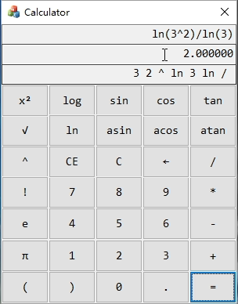
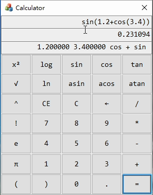

- [项目概述](#项目概述)
- [开发环境](#开发环境)
- [需求分析](#需求分析)
- [具体实现](#具体实现)
    - [主算法](#主算法)
    - [界面设计](#界面设计)
- [结果展示](#结果展示)
- [更多演示及源码](#更多演示及源码)
- [问题与不足](#问题与不足)
- [彩蛋](#彩蛋)
- [相关参考](#相关参考)

## 项目概述


本项目基于逆波兰表达式，巧妙利用优先级表的方式解析表达式优先级，大大提高了解析效率。在后台逻辑的基础上，采用c++的MFC编写界面，简洁高效的同时不失优雅美观。

## 开发环境

Windows10

Microsoft Visual Studio Community 2017 
版本 15.9.11

MFC

## 需求分析


以windows附件中的计算器为分析。

一个基本的计算器最基本的计算是加减乘除，在此基础上，添加实数运算，括号，退格清空等功能。

进一步来说，实现乘方、阶乘、三角函数、对数、取模等运算。

最后，提供历史存储，内存等功能。

除此之外，一个强悍的计算器还应该包括：界面优雅、性能强悍、占用内存小、支持大数高精度运算、提供差错检验等功能。

本项目基本实现了前两个功能。

主要包含以下功能：

- 加减乘除
- 实数运算
- 退格清空
- 特殊字符
- 乘方运算
- 阶乘运算
- 三角函数
- 对数运算

表达式解析需要用到逆波兰表达式：

>逆波兰表达式又叫做后缀表达式。在通常的表达式中，二元运算符总是置于与之相关的两个运算对象之间，这种表示法也称为中缀表示。波兰逻辑学家J.Lukasiewicz于1929年提出了另一种表示表达式的方法，按此方法，每一运算符都置于其运算对象之后，故称为后缀表示。

界面方面，考虑到性能问题，底层从c++开始写，界面自然也使用c++的界面。常见流行的c++界面库有MFC、QT。这里采用MFC，虽然有很多缺点不足，但快速搭建一个计算器用于学习足矣。

## 具体实现

### 主算法

表达式解析器(Expression Parser, Evaluator)，逆波兰表达式是常用而高效的算法。其简单逻辑为：如果当前字符为变量或者为数字，则压栈，如果是运算符，则将栈顶两个元素弹出作相应运算，结果再入栈，最后当表达式扫描完后，栈里的就是结果。进一步考虑运算符之间的优先级，考虑入栈还是弹栈。如此问题转化为运算符的优先级解析。

运算符优先级解析，常见的实现方法就是对每个运算符分别进行判断。但此方法不但代码繁琐，而且可拓展性不高。一个解决方法是给每个运算符定义优先级。但在此采用另一种方法，即构造优先级表表示运算符优先级：

```c++
//加、减、乘、除、乘方、阶乘、左括号、右括号、起始符与终止符
const char pri[N_OPTR][N_OPTR] = { //运算符优先等级 [栈顶] [当前]
    /*              |-------------------- 当 前 运 算 符 --------------------| */
    /*              +      -      *      /      ^      !      (      )      \0 */
    /* --  + */    '>',   '>',   '<',   '<',   '<',   '<',   '<',   '>',   '>',
    /* |   - */    '>',   '>',   '<',   '<',   '<',   '<',   '<',   '>',   '>',
    /* 栈  * */    '>',   '>',   '>',   '>',   '<',   '<',   '<',   '>',   '>',
    /* 顶  / */    '>',   '>',   '>',   '>',   '<',   '<',   '<',   '>',   '>',
    /* 运  ^ */    '>',   '>',   '>',   '>',   '<',   '<',   '<',   '>',   '>',
    /* 算  ! */    '>',   '>',   '>',   '>',   '>',   '>',   ' ',   '>',   '>',
    /* 符  ( */    '<',   '<',   '<',   '<',   '<',   '<',   '<',   '=',   ' ',
    /* |   ) */    ' ',   ' ',   ' ',   ' ',   ' ',   ' ',   ' ',   ' ',   ' ',
    /* -- \0 */    '<',   '<',   '<',   '<',   '<',   '<',   '<',   ' ',   '='
};

#define N_OPTR 9 //运算符总数
typedef enum { ADD, SUB, MUL, DIV, POW, FAC, L_P, R_P, EOE } Operator; //运算符集合
Evaluator::Operator Evaluator::optr2rank(char op)
{
    switch (op) {
    case '+': return ADD; //加
    case '-': return SUB; //减
    case '*': return MUL; //乘
    case '/': return DIV; //除
    case '^': return POW; //乘方
    case '!': return FAC; //阶乘
    case '(': return L_P; //左括号
    case ')': return R_P; //右括号
    case '\0': return EOE; //起始符和终止符
    default: exit(-1);  //未知运算符
    }
}

//比较两个运算符的优先级
char Evaluator::orderBetween(char op1, char op2)
{
    return pri[optr2rank(op1)][optr2rank(op2)];
}
```

如此，便把运算符优先级比较统一起来，当需要添加新的运算符时，只需直接修改运算符优先级表即可。

接下来需要考虑如何从一个字符串中读取数字和数学函数名称：

```c++
//读取一个实数，并移动指针
double Evaluator::readNumber(char *& p)
{
    double res = *p - '0'; //读取第一个数字
    while (isdigit(*++p)) //继续读取，直到非数字停止
        res = res * 10 + *p - '0'; //拼接读到的数字
    if ('.' != *p) return res; //没有小数点，直接返回
    double frac = 1;
    while (isdigit(*++p)) //继续读取小数部分
        res += (*p - '0')*(frac /= 10); //拼接小数部分
    return res; //返回读到的实数
}

const char* mathFunc[8] = {
    "sin","cos","tan",
    "asin","acos","atan",
    "log","ln"
};
stack<int> funcId;
//读取数学函数名称并移动指针
void Evaluator::readFunc(char*& p)
{
    string s;
    int idx = 0;
    while (isalpha(*p)) //如果是字母，一直读取
        s.push_back(*p++);
    for (int i = 0; i < 8; i++) { //从给定数学函数集中寻找
        if (s == mathFunc[i]) { //找到名称匹配的数学函数
            funcId.push(i); //压栈并
            return; //返回
        }
    }
}
```

接下来考虑将字符串中的实际操作映射成实际的运算：

```c++
//计算阶乘
__int64 Evaluator::factorial(__int64 n)
{
    return n > 1 ? n * factorial(n - 1) : 1;
}
//计算一元运算符
double Evaluator::calcu(char op, double pOpnd)
{
    if (op == '!') return (double)factorial((__int64)pOpnd);
    else exit(-1);
}
//计算二元运算符
double Evaluator::calcu(double pOpnd1, char op, double pOpnd2)
{
    switch (op) {
    case '+': return pOpnd1 + pOpnd2;
    case '-': return pOpnd1 - pOpnd2;
    case '*': return pOpnd1 * pOpnd2;
    case '/': return pOpnd1 / pOpnd2;
    case '^': return pow(pOpnd1, pOpnd2);
    default: exit(-1);
    }
}
//计算数学函数
double Evaluator::calcu(double pOpnd)
{
    int i = funcId.top();  funcId.pop();
    switch (i)
    {
    case 0: return sin(pOpnd);
    case 1: return cos(pOpnd);
    case 2: return tan(pOpnd);
    case 3: return asin(pOpnd);
    case 4: return acos(pOpnd);
    case 5: return atan(pOpnd);
    case 6: return log10(pOpnd);
    case 7: return log(pOpnd);
    default: exit(-1);
    }
}
```

考虑表达式字符串的预处理，去除字符串中的空白字符，因为c++字符串处理能力有限，所以一些函数需要从头写起，同时也是一种高效的写法。

```c++
void Evaluator::deblank(char * str)
{
    for (char* p = str; *p != '\0'; p++)
        if (*p != ' ') *str++ = *p;
    *str = '\0';
}
```

接下来是逆波兰表达式的主算法：

```c++
//解析字符串S，同时生成逆波兰表达式存储到RPN中
double Evaluator::evaluate(char * S, char *& RPN)
{
    *RPN = '\0'; //初始化逆波兰表达式
    deblank(S); //去除S的空格
    stack<double> opnd;
    stack<char> optr; //运算数栈,运算符栈
    optr.push('\0'); //尾哨兵'\0'也作为头哨兵先入栈
    while (!optr.empty()) { //在运算符栈非空之前,逐个处理表达式中各字符
        if (isdigit(*S)) { //若当前字符为操作数,则
            opnd.push(readNumber(S));
            append(RPN, opnd.top()); //读入操作数,并将其接至RPN末尾
        }
        else if (isalpha(*S)) { //是数学函数
            readFunc(S);
        }
        else //若当前字符为运算符,则
            switch (orderBetween(optr.top(), *S)) { //视其与栈顶运算符之间优先级高低分别处理
            case '<': //栈顶运算符优先级更低时
                optr.push(*S); S++; //计算推迟,当前运算符进栈
                break;
            case '=': //优先级相等(当前运算符为右括号或者尾部哨兵'\0')时
                if (*S == ')' && !funcId.empty()) { //含有数学函数
                    append(RPN, mathFunc[funcId.top()]); //数学函数名续接至RPN末尾
                    double pOpnd = opnd.top(); opnd.pop(); //只需取出一个操作数,并
                    opnd.push(calcu(pOpnd)); //实施一元运算,结果入栈
                }
                optr.pop(); S++; //脱括号并接受下一个字符
                break;
            case '>': { //栈顶运算符优先级更高时,可实施相应的计算,并将结果重新入栈
                char op = optr.top(); optr.pop();
                append(RPN, op); //栈顶运算符出栈并续接至RPN末尾
                if ('!' == op) { //若属于一元运算符
                    double pOpnd = opnd.top(); opnd.pop(); //只需取出一个操作数,并
                    opnd.push(calcu(op, pOpnd)); //实施一元运算,结果入栈
                }
                else { //对于其他(二元)运算符
                    double pOpnd2 = opnd.top(); opnd.pop();
                    double pOpnd1 = opnd.top(); opnd.pop(); //取出后,前操作数
                    opnd.push(calcu(pOpnd1, op, pOpnd2));
                }
                break;
            }
            default: exit(-1); //逢语法错误,不做处理直接退出
            } //switch
    } //while
    double rt = opnd.top(); opnd.pop();
    return rt; //弹出并返回最后的计算结果
}
```

### 界面设计

考虑到主算法基于高效率的c++，虽然可以将c++打包成dll供其他语言调用，采用更好的语言编写界面。但c++本身也有一些优秀的界面库，例如MFC历史悠久，直接调用windowsAPI进行界面绘图，虽然其有很多弊端缺点，却不失为学习系统底层的好方法。而且对于本项目而言，主要用于学习算法所用，不打算商用，要求不高。故采用效率高效的MFC编写，优点也是明显的，编写完的程序大小只有104k，小巧精悍，界面也不算太丑。


本界面主要用到两个控件：Edit Control, Button。

Edit Control，设为只读，用于显示数据而用，用户不能修改；文本选用右对齐，符合计算器用户的习惯。

在此基础上，为Edit Control绑定变量，当需要获取或修改Edit Control的内容时，只需要简单对绑定的变量进行操作即可，大大简化了编程难度。

```c++
UpdateData(); //默认参数为True，表示更新编辑框数据到变量
...
UpdateData(false); //参数为false表示更新变量到编辑框
```

Button而言，每个Button采用固定大小。

对于一些要输入的数字或者所见即所得的运算符，统一挂钩一个事件，极大简化了编程的复杂性，提高了代码的复用性、可拓展性。

```c++
//共享click事件,插入数字或运算符
void CMFCCalculatorDlg::OnBnClickedButtonInsert()
{
    // TODO: 在此添加控件通知处理程序代码
    int pos = edit1.CharFromPos(edit1.GetCaretPos()); //获取光标位置
    CString text;
    WPARAM now = GetCurrentMessage()->wParam; //获取调用者编号
    GetDlgItem(now)->GetWindowTextW(text); //获取调用者的文本

    UpdateData(); //默认参数为True，表示更新编辑框数据到变量
    CString S = editString1; //编辑框1字符串
    editString1.Insert(pos, text); //插入文本
    UpdateData(false); //参数为false表示更新变量到编辑框
}
```

对于要插入的数学符号，也是统一成了一个事件

```c++
//共享click事件,插入数学函数
void CMFCCalculatorDlg::OnBnClickedButtonInsertFunction()
{
    int pos = edit1.CharFromPos(edit1.GetCaretPos()); //获取光标位置
    CString text;
    WPARAM now = GetCurrentMessage()->wParam; //获取调用者编号
    GetDlgItem(now)->GetWindowTextW(text); //获取调用者的文本
    if (text.Compare(_T("x²")) == 0)
    {
        text = _T("^2");
    }
    else if (text.Compare(_T("√")) == 0)
    {
        text = _T("^0.5");
    }
    else
    {
        text.Append(_T("(")); //为数学函数添加左括号
    }
    UpdateData(); //默认参数为True，表示更新编辑框数据到变量
    CString S = editString1; //编辑框1字符串
    editString1.Insert(pos, text); //插入文本
    UpdateData(false); //参数为false表示更新变量到编辑框
}
```

退格键单独一个事件

```c++
//退格键
void CMFCCalculatorDlg::OnBnClickedButtonBackspace()
{
    // TODO: 在此添加控件通知处理程序代码
    int pos = edit1.CharFromPos(edit1.GetCaretPos()); //获取光标位置
    UpdateData(); //默认参数为True，表示更新编辑框数据到变量
    CString S = editString1; //编辑框1字符串
    if (pos > 0) editString1.Delete(pos - 1, 1); //删除一个字符
    UpdateData(false); //参数为false表示更新变量到编辑框
}
```

清空键单独一个事件

```c++
//清空键
void CMFCCalculatorDlg::OnBnClickedButtonClear()
{
    // TODO: 在此添加控件通知处理程序代码
    UpdateData(); //默认参数为True，表示更新编辑框数据到变量
    editString1 = CString(); //清空文本框
    editString2 = CString(); //清空文本框
    editString3 = CString(); //清空文本框
    UpdateData(false); //参数为false表示更新变量到编辑框
}
```

接下来是等于号的事件，点击即可计算出结果

```c++
//= btn
void CMFCCalculatorDlg::OnBnClickedButtonGetAnswer()
{
    // TODO: 在此添加控件通知处理程序代码
    //GetDlgItem(IDC_EDIT1)->GetWindowTextW; //获取编辑框文本方法一
    UpdateData(); //默认参数为True，表示更新编辑框数据到变量
    CString S = editString1; //编辑框1字符串
    if (S.GetLength() == 0) return;
    S.Replace(_T("π"), _T("3.14159265358979"));
    S.Replace(_T("e"), _T("2.71828182845904"));

    char* rpn = (char *)malloc(sizeof(char) * 1024);
    CStringA SA(S);
    static char buf[1024];
    sprintf(buf, "%s", (char*)SA.GetString());
    double res = Evaluator().evaluate(buf, rpn);
    CString S1, S2(rpn);
    S1.Format(_T("%f"), res);
    editString2 = S1;
    editString3 = S2;
    UpdateData(false); //参数为false表示更新变量到编辑框
}
```

这次编写MFC程序很明显的感受也是大家的感受就是，MFC布局重构是多么的麻烦，它不像一些其他的界面库具有自动排列或者对齐，一切只能手动移动和手动设置大小，当布局产生了大的变化，只能推到一切从来。

## 结果展示

编译成功


乘方运算


对数运算



加减乘除


阶乘运算


三角函数



特殊字符


## 更多演示及源码

https://github.com/qq734628996/Calulator

## 问题与不足

限于本人能力有限，错误在所难免。

而且限于本人精力有限，以下例举一些本项目未能考虑的东西：

- 异常检错能力。本项目对于异常情况只是简单做了退出程序处理，这要求用户必须输入正确的表达式。事实上，一个优秀的计算器应该包含自动纠错能力。
- 存储功能。本项目未实现
- 高精度运算。本项目为实现，实现高精度实数的乘方、数学函数的运算极度繁杂，本程序目前暂未考虑实现。
- 界面自适应大小。MFC并不会自动调整控件大小，所以用户只能采用一个固定的大小使用计算器，这是不好的，一个完美的计算器例如微软自带的计算器，可以根据界面大小自适应调整大小和排列。

## 彩蛋

本人在编程时便思考一个问题：如何在1到9的排列中插入适当的运算符和括号，使之运算结果为2019。

经过一番思考，采用如下算法：dfs随机生成一个表达式，运算结果，如果等于2019则保留结果。

```python
import random

'''2019
1+2-(3+4-5-6)*7*8*9
1+2-(3*(4-5-6)-7)*8*9
1+2+(3+4)*(5+6-7)*8*9
1+2*3+4*(5-6+7*8*9)
'''

op=['+','-','*',]
def dfs(l,r):
    if l==r:
        return str(l)
    m=random.randint(l,r-1)
    return '(%s%s%s)'%(dfs(l,m),op[random.randint(0,2)],dfs(m+1,r))

for i in range(10000000):
    res=dfs(1,9)
    ans=eval(res)
    if (ans==2019):
        print(res)
```

值得一提的是，python自带表达式解析器，eval()函数，一条语句解决计算器的关键功能。

## 相关参考

[1] 数据结构 作者: 邓俊辉  出版社: 清华大学出版社 副标题: C++语言版 第三版 出版年: 2013-9 页数: 389 ISBN: 9787302330646